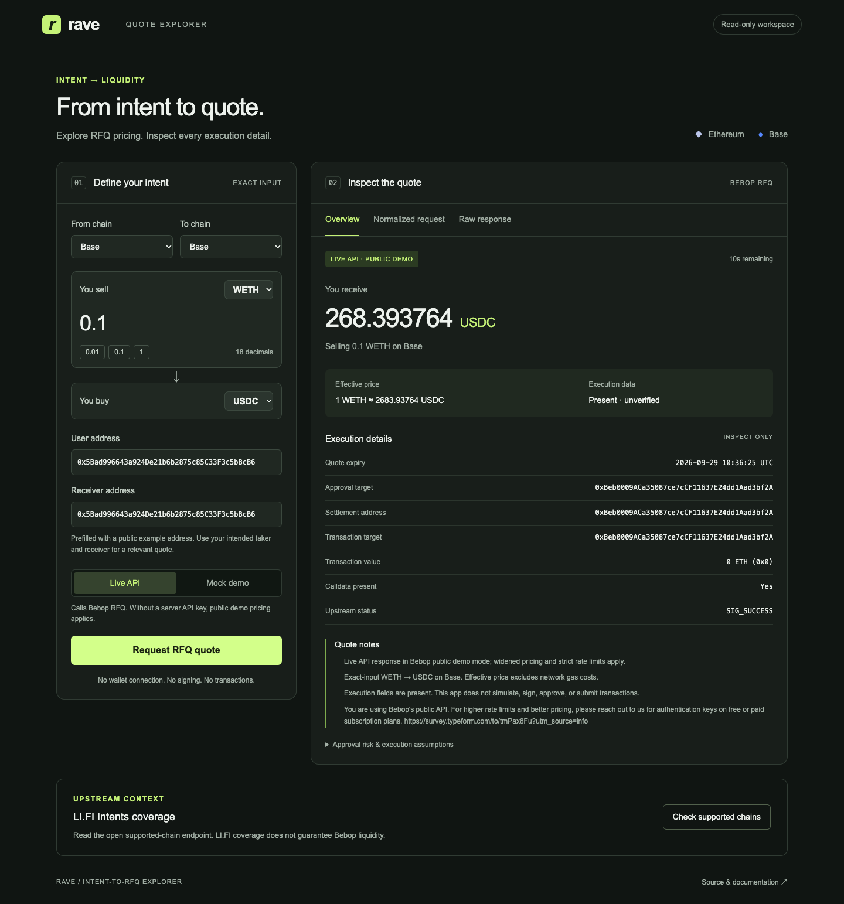
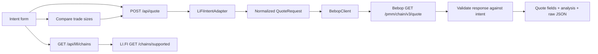

# Rave · Intent-to-RFQ Quote Explorer

A small, read-only quote explorer that maps a simplified LI.FI-style swap intent to Bebop's public RFQ API. Built with Next.js, TypeScript, Zod, viem, and Tailwind CSS.

**No wallet connection, private keys, signatures, approvals, or transaction submission.**

**[Open the live demo](https://rave-intent-rfq-explorer.vercel.app/)** · Deployed on Vercel from `main`. The live API uses Bebop's unauthenticated public demo pricing unless a server-side API key is configured.



[View the live three-size comparison screenshot](docs/screenshots/07-live-size-comparison.png) (captured quotes are historical and expired).

## Run locally

Requires Node.js 22+ and pnpm 11.19.0 (`npm install -g pnpm@11.19.0`).

```bash
git clone https://github.com/Hahn-G/rave-intent-rfq-explorer.git
cd rave-intent-rfq-explorer
pnpm install --frozen-lockfile
cp .env.example .env.local
pnpm dev
```

Open [localhost:3000](http://localhost:3000). A public example address and a Base WETH → USDC intent are prefilled. Click **Request RFQ quote** for a real API request, or explicitly select **Mock demo** for an offline fixture. Changing an input clears the previous quote. Quotes are never automatically refreshed.

Click **Compare 3 trade sizes** to request WETH `0.01 / 0.1 / 1` or stablecoin `10 / 100 / 1000` quotes for the same route and addresses. The table retains all three outcomes for inspection, including errors and skipped requests. It shows output, effective unit price, difference from the smallest successful size in basis points, capture time, and expiry. Each row can be opened in the full quote inspector.

Optional production RFQ access:

```dotenv
BEBOP_API_KEY=your_bebop_api_key
```

This is an API credential, **not a wallet private key**. It stays on the server and is sent as `Authorization: Bearer ...`. Never use `NEXT_PUBLIC_` for this variable.

### Important: current public API behavior

Bebop's current [authentication documentation](https://docs.bebop.xyz/core-concepts/authentication) says unauthenticated RFQ requests return widened, heavily rate-limited **upstream demo quotes**. Production pricing requires an API key. This is distinct from the app's synthetic mock mode:

| UI label                 | Source                                          | Meaning                                                              |
| ------------------------ | ----------------------------------------------- | -------------------------------------------------------------------- |
| Live API · Public demo   | Actual Bebop HTTP response, no key              | Upstream demo pricing; may contain transaction data                  |
| Live API · Authenticated | Actual Bebop HTTP response, server key supplied | Authenticated request; still requires execution checks               |
| Mock · Not executable    | Local deterministic fixture                     | Fixed illustrative prices, no transaction data or contract addresses |

The app never silently falls back to mock data. Access labels describe how the request was made, not a guarantee of quote quality or execution success.

## Coverage and input

| Chain    | Chain ID | Tokens                                 |
| -------- | -------- | -------------------------------------- |
| Ethereum | 1        | WETH (18 decimals), USDC (6), USDT (6) |
| Base     | 8453     | WETH (18), native USDC (6)             |

Chain-specific contract addresses are hardcoded in [`src/config/chains.ts`](src/config/chains.ts). Symbols and supported token addresses are accepted case-insensitively; outgoing addresses are checksummed. Only exact-input, one-token-to-one-token, **same-chain** swaps are supported. Cross-chain requests, same-token swaps, unsupported tokens, invalid addresses and zero addresses are rejected.

```json
{
  "fromChain": 8453,
  "toChain": 8453,
  "fromToken": "WETH",
  "toToken": "USDC",
  "amountIn": "0.1",
  "userAddress": "0x5Bad996643a924De21b6b2875c85C33F3c5bBcB6",
  "receiverAddress": "0x5Bad996643a924De21b6b2875c85C33F3c5bBcB6"
}
```

`amountIn` is a human-readable **decimal string**, never a JSON number. The adapter rejects exponent notation, excess precision and amounts exceeding uint256. It converts to integer base units without floating-point arithmetic or silent rounding. The example address comes from Bebop documentation; there is no assumption that the viewer controls or has funded it.

## Intent model and data flow

An intent expresses a desired outcome instead of prescribing execution steps. LI.FI's current marketplace matches user intents against solver standing quotes; solvers fulfill outcomes and the settlement system verifies delivery. This assignment borrows a simplified input model and routes it directly to Bebop RFQ. It does **not** implement LI.FI's full order structure, interoperable-address encoding, escrow, solver selection, funding, signing, or settlement lifecycle.



### Intent-to-RFQ mapping

| Intent                 | Normalization                                     | Bebop request                          |
| ---------------------- | ------------------------------------------------- | -------------------------------------- |
| `fromChain`, `toChain` | Resolve supported chain and enforce equality      | Chain slug in URL (`ethereum`, `base`) |
| `fromToken`            | Resolve chain-specific address                    | `sell_tokens`                          |
| `toToken`              | Resolve chain-specific address                    | `buy_tokens`                           |
| `amountIn`             | Decimal string → sell-token base units            | `sell_amounts`                         |
| `userAddress`          | Validate and checksum                             | `taker_address`                        |
| `receiverAddress`      | Validate and checksum, preserve distinct receiver | `receiver_address`                     |
| —                      | Direct standard approval mode                     | `approval_type=Standard`               |

`BebopClient` is a fetch-injected API abstraction. It handles transport errors and validates response schemas. Response token addresses, decimals, sold amount, chain, taker and receiver must match the request. Transaction `from` and `chainId` are checked when provided. Contract addresses remain separate; the app does not assume they are equal.

### Bebop response fields

| Field                                   | Display / interpretation                                                                               |
| --------------------------------------- | ------------------------------------------------------------------------------------------------------ |
| `sellTokens[address].amount`            | Base-unit sell amount, formatted with token decimals                                                   |
| `buyTokens[address].amount`             | Base-unit quoted output, formatted with token decimals                                                 |
| Calculated effective price              | Human-unit buy amount ÷ sell amount, truncated to 12 decimal places using BigInt; excludes network gas |
| `expiry`                                | Unix seconds; displayed in UTC with a countdown and expired state                                      |
| `approvalTarget`                        | ERC-20 spender returned by the quote                                                                   |
| `settlementAddress`                     | Returned settlement / routing contract                                                                 |
| `tx.to`                                 | Transaction destination; kept separate from the approval target                                        |
| `tx.value`                              | Native currency value in wei, shown raw and as ETH; not the gas fee                                    |
| `tx.data`                               | Whether valid, nonempty hex calldata is present; inspect full data in Raw response                     |
| `status`, `quoteId`, `warnings`, `info` | Quote status, identifier, and upstream context                                                         |

Absent execution fields display **Not returned**. Missing or empty calldata is never reported as present. An expired or incomplete response remains inspectable; no response is described as verified executable merely because it contains calldata.

## App API

### `POST /api/quote`

Body: `{ "intent": { ... }, "mode": "live" | "mock" }`. Mode defaults to `live`.

```bash
curl http://localhost:3000/api/quote \
  -H 'Content-Type: application/json' \
  -d '{"mode":"live","intent":{"fromChain":8453,"toChain":8453,"fromToken":"WETH","toToken":"USDC","amountIn":"0.1","userAddress":"0x5Bad996643a924De21b6b2875c85C33F3c5bBcB6","receiverAddress":"0x5Bad996643a924De21b6b2875c85C33F3c5bBcB6"}}'
```

Returns normalized request, amounts, price, expiry, execution fields, analysis and the original quote response. Both client and server quote responses avoid caching. Upstream requests time out after 12 seconds. No background polling or automatic RFQ retries consume quota.

Errors are structured as `{ "error": { "code", "message", "retryAfter"? } }`:

| Code                | HTTP      | Handling                                                                     |
| ------------------- | --------- | ---------------------------------------------------------------------------- |
| `INVALID_INPUT`     | 400 / 413 | Fix invalid JSON, input, or oversized body                                   |
| `UNSUPPORTED_ROUTE` | 422       | Select supported same-chain tokens                                           |
| `NO_QUOTE`          | 422       | Upstream error envelope; inspect reason and try another size / route         |
| `RATE_LIMITED`      | 429       | Preserve Retry-After when present; disable live quote button during cooldown |
| `AUTH_REQUIRED`     | 502       | Check upstream access / server credential                                    |
| `UPSTREAM_FAILURE`  | 502       | Network or upstream HTTP failure                                             |
| `INVALID_RESPONSE`  | 502       | Reject malformed / mismatched data                                           |
| `UPSTREAM_TIMEOUT`  | 504       | Upstream request exceeded deadline                                           |

Bebop may return an error object with HTTP 200; this is treated as an error, not a successful quote.

### Trade-size comparison — bonus

The browser sends three independent `POST /api/quote` requests using the same intent except `amountIn`; no new API or transaction endpoint is involved. Live requests run sequentially with an 800 ms pause to reduce pressure on the public demo rate limit. The table keeps successful results even if a later size fails. On HTTP 429 it stops requesting, marks remaining sizes skipped, and applies the returned cooldown. It never fabricates a missing price or switches to mock mode. Mock comparisons are explicitly labeled synthetic.

The difference column compares **output per input token** using raw integer amounts, avoiding floating-point precision loss. Positive basis points mean a higher effective unit price than the smallest successful quote. It is an observational comparison, **not** a slippage or price-impact estimate: quotes are captured at different times, may expire within seconds, and omit gas. No comparison history is stored after changing the route or refreshing the page.

### `GET /api/lifi/chains` — bonus integration

Calls the real open `https://order.li.fi/chains/supported` endpoint, on demand. The UI displays Ethereum/Base availability, timestamp and the normalized response. It uses the response's `chainId`, **not** its internal database `id`. LI.FI coverage is informational and does not gate or imply Bebop liquidity. No LI.FI order is created.

## Tests and build

```bash
pnpm test
pnpm typecheck
pnpm build
pnpm start
```

Tests mock fetch responses and cover precision, chain/token validation, address normalization, receiver preservation, RFQ mapping, auth, HTTP 200 error envelopes, rate limits, network failures, timeouts, response mismatches, expiry, empty calldata, mock isolation, LI.FI chain IDs, the app route, exact basis-point comparison and partial results after a rate limit. Tests do not spend live API quota. CI runs tests, typechecking and a production build.

## Docker / deployment

One-command local production startup:

```bash
docker compose up --build
```

Optionally pass `BEBOP_API_KEY` in your environment. The container exposes port 3000. See [`docs/DEPLOYMENT.md`](docs/DEPLOYMENT.md) for Vercel import and demo verification.

Docker configuration is supplied but was not run in the development environment, where Docker was unavailable. Local Node.js production build and browser verification passed.

## Limitations and execution assumptions

- Only a curated token list and same-chain exact-input swaps. No bridging, native ETH input, multi-token orders or full intent lifecycle.
- Successful real API responses depend on current liquidity, provider availability and access policy. No production API key is included.
- Quoted output is not a profitability estimate. Gas is excluded, prices may include provider fees, and fixed mock prices are not market data.
- No balance/allowance lookup, calldata decoding, simulation, signature validation, or contract allowlist verification. Calldata presence is only a structural observation.
- Before execution elsewhere, independently verify chain, token contracts, participant addresses, allowance, gas, returned contracts, signatures and expiry. A quote can expire before inclusion.
- Approval gives a spender authority over tokens. Prefer exact-amount allowances and verify the spender independently. Never infer the spender from another contract field.
- API keys stay on the server, but the sample app has no per-user authentication or durable abuse protection. Add platform rate limits and access controls before exposing an authenticated, quota-bearing API broadly.
- The comparison table keeps three results in the current view only. Live requests are sequential, may hit Bebop's public rate limit, and do not establish a simultaneous market curve. There is no historical quote storage.
- No retries, quote caching, analytics or database. The user address is sent to Bebop as part of the requested quote and is not saved by this app.

## Submission and AI disclosure

- Repository: [Hahn-G/rave-intent-rfq-explorer](https://github.com/Hahn-G/rave-intent-rfq-explorer)
- Live demo: [rave-intent-rfq-explorer.vercel.app](https://rave-intent-rfq-explorer.vercel.app/)
- Demo/screenshot: see [`docs/DEMO.md`](docs/DEMO.md)
- AI assistance and verification: [`AI_USAGE.md`](AI_USAGE.md)

## References

- [LI.FI Intents introduction](https://docs.li.fi/lifi-intents/introduction)
- [LI.FI Intents API overview](https://docs.li.fi/lifi-intents/intents-api/api-overview)
- [Bebop RFQ quote reference](https://docs.bebop.xyz/rfq-api/api-reference/quote)
- [Bebop authentication](https://docs.bebop.xyz/core-concepts/authentication)
- [Bebop settlement and contracts](https://docs.bebop.xyz/core-concepts/settlement-smart-contracts)

The assignment's older Bebop documentation link redirects to the current documentation site; this project follows the current v3 RFQ reference.
